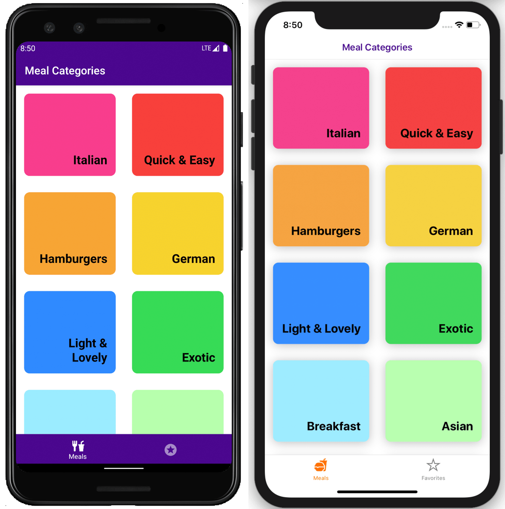

# The Meals App

This project was bootstrapped with [React Native CLI](https://reactnative.dev/docs/environment-setup). <br />



## Available Scripts

In the project directory, you can run:

#### Install:

```bash
yarn install
# or
npm install
```

Install the dependencies in the local `node_modules` folder. The command will install all modules listed as dependencies in `package.json`.

#### Pod Install:

```
npx pod-install
```

This command is to be used to retrieve the pods for the project.

#### Build .apk:

```
cd android
./gradlew assembleRelease
```

Generating the release APK for Android.<br />
Path to file: `android/app/build/outputs/apk/release/app-release.apk`

#### iOS:

```bash
yarn ios
# or
npm run ios
```

Opening an iOS simulator.

The screen will reload if you make edits.<br />
You will also see any lint errors on the screen.

#### Android:

```bash
yarn android
# or
npm run android
```

Opening an Android simulator.

The screen will reload if you make edits.<br />
You will also see any lint errors on the screen.

#### Prettier:

```bash
yarn prettier
# or
npm run prettier
```

To automatically format your files using [Prettier](https://prettier.io/).

#### Lint:

```bash
yarn lint
# or
npm run lint
```

To automatically lint your code using [ESLint](https://eslint.org).

#### Test:

```bash
yarn test
# or
npm run test
```

Launches the test runner in the interactive watch mode using [Jest](https://jestjs.io).
